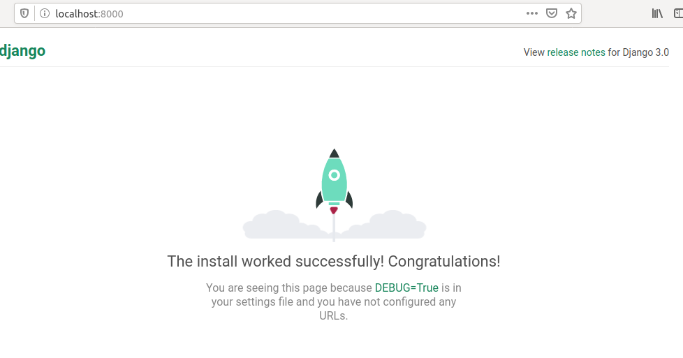
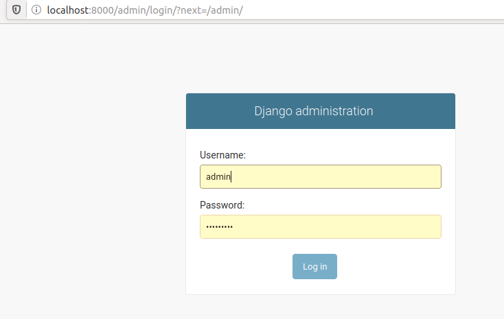
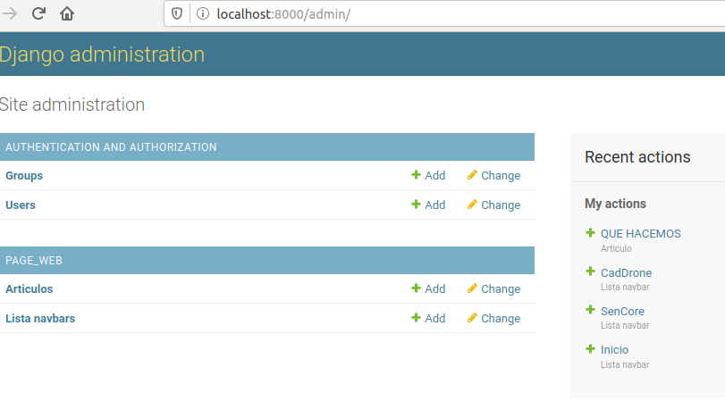
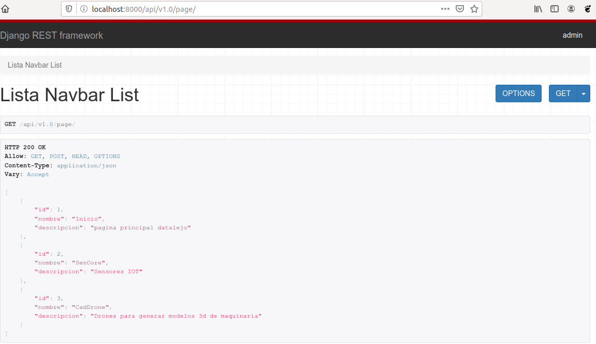

# contruyendo proyecto django-vue.

##### creación proyecto django

~~~
django-admin startproject web_datalejo
~~~
##### renombramos el proyecto ya que la carpeta externa contendra varias apps
~~~
mv web_datalejo/ web_proys_datalejo
~~~
##### creamos una nueva app llamada page_web
~~~
cd web_proys_datalejo/

django-admin startapp page_web
~~~
##### entramos a web_datalejo y dentro de settings.py agregamos la app generada

~~~

INSTALLED_APPS = [
    'django.contrib.admin',
    'django.contrib.auth',
    'django.contrib.contenttypes',
    'django.contrib.sessions',
    'django.contrib.messages',
    'django.contrib.staticfiles',
    'page_web'
]
~~~
##### Ahora vamos a crear nuestro modelo en "page_web/models.py"

~~~
class ListaNavbar(models.Model):
    nombre = models.CharField(max_length=20)
    descripcion = models.CharField(max_length=50)

    def __str__(self):
        return self.nombre

class Articulo(models.Model):
    titulo =  models.CharField(max_length=20)
    contenido =  models.CharField(max_length=100)
    imagen =  models.CharField(max_length=20)

    def __str__(self):
        return self.titulo

~~~
##### Para editar los modelos desde el admin incluimos en "page/admin.py" nuestros nuevos modelos 
~~~
from .models import ListaNavbar,Articulo

admin.site.register(ListaNavbar)

admin.site.register(Articulo)

~~~ 
##### A continuación hacemos la migracion de los modelos a la base de datos 
~~~
python manage.py makemigrations
python manage.py migrate
~~~
##### despues de esto corremos el servidor desde la consola
~~~
python manage.py runserver
~~~

##### para detenerlo oprimimos Ctrl+C.
##### El siguiente paso es iniciar el admin, para esto escribimos en la consola
~~~
python manage.py createsuperuser
~~~
##### nos pedirá nombre de usuario, correo y password. Ahora reiniciamos el servidor y entramos a <localhost:8000/admin/> que nos mostrará lo suguiente:
 

##### después de entrar vemos las opciones que tenemos para agregar campos en nuestra base de datos por lo que agregamos algunas y continuamos 

## Instalar librería restfull django 
##### escribimos en la consola (asegurandonos de que estamos dentro de una virtualenv)
~~~
pip install djangorestframework
~~~
##### Ahora vamos a web_datalejo e incluimos el api rest al proyecto 
~~~

INSTALLED_APPS = [
    'django.contrib.admin',
    'django.contrib.auth',
    'django.contrib.contenttypes',
    'django.contrib.sessions',
    'django.contrib.messages',
    'django.contrib.staticfiles',
    'page_web',
    'rest_framework',
]
~~~
##### A continuación creamos el archivo "page_web/serializer.py" para poder transportar el modelo por el trotocolo http. El archivo tendrá el siguiente contenido
~~~
from .models import ListaNavbar, Articulo
from rest_framework import serializers

class ListaNavbarSerializers(serializers.ModelSerializer):
    class Meta:
        model = ListaNavbar
        fields = '__all__'

~~~
Ahora cremos el archivo "page_web/viewsets.py" que se encarga de hacer el CrUD para nuestro modelo. Tendrá el siguiente contenido
~~~
from rest_framework import viewsets
from .models import ListaNavbar
from .serializer import ListaNavbarSerializers

class ListaNavbarViewSet(viewsets.ModelViewSet):
    queryset = ListaNavbar.objects.all()
    serializer_class = ListaNavbarSerializers
    
~~~
##### El tercer archivo es el clásico urls.py
~~~
from rest_framework import routers
from .viewsets import ListaNavbarViewSet

router = routers.SimpleRouter()
router.register('page', ListaNavbarViewSet)
urlpatterns = router.urls
~~~
##### Ahora vamos a "web_datalejo/urls.py" para agregar la url de nuestra api

~~~
from django.contrib import admin
from django.urls import path, include

urlpatterns = [
    path('admin/', admin.site.urls),
    path('api/v1.0/', include('page_web.urls')),
]
~~~ 
##### Para acceder a los datos iniciamos el servidor y  desde la barra de navegación   escribmos la parte "api/v1.0/" que esta en  "path('api/v1.0/', include('page_web.urls'))," del settings.py y el register "page" del "router.register('page', ListaNavbarViewSet)" en "page_web/urls" por lo que queda asi:

## creacion del frontend con vuejs 
~~~
vue init webpack frontend
cd frontend/
npm run dev
sudo npm i bootstrap-vue
~~~
##### Creamos la carpeta de componentes de nuestra app page_web en "frontend/scr/components/page_web". Dentro de esta ponemos el archivo ListaNavbar.vue y ponemos el siguiente texto:
~~~

~~~ 
##### Ahora ponemos del archivo  frontend/router/index.js agremamos la Navbar 
# espacio para agregar info

#### al terminar la parte del diseño podemos pasar a consruir la página con el siguiente comando:
~~~
npm run build
~~~
#### esto generará una carpeta llamada /frontend/dist.
#### Por otra parte agregamos al archivo settings.py lo siguiente 
~~~

STATIC_ROOT = os.path.join(BASE_DIR, 'static')

STATIC_URL = '/static/'

STATICFILES_DIRS = [
    os.path.join(BASE_DIR, 'frontend/dist/static/')
    # Puedes agregar mas carpetas si es necesario
]
~~~

